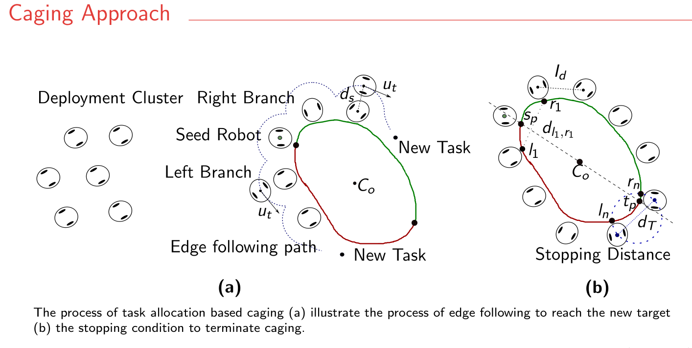
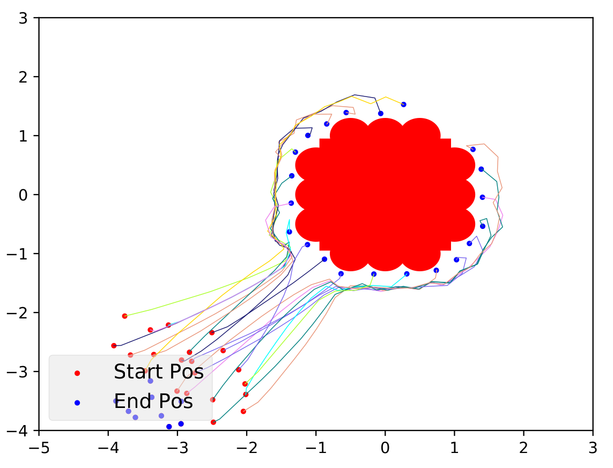
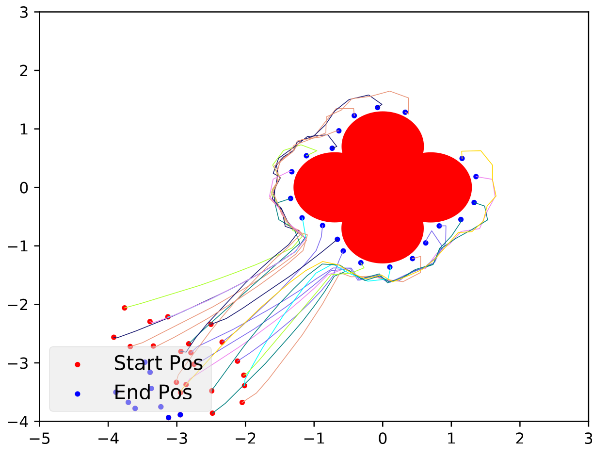
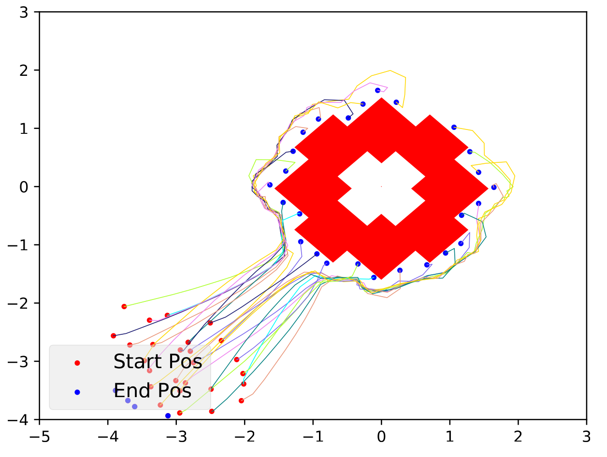

# 🐜 SwarmHaul: Decentralized Caging and Transport by Robot Swarms

**SwarmHaul** is a biologically inspired multi-robot system for collective object transport, motivated by the efficiency of ant colonies. Ants are known to move objects significantly larger than themselves with remarkable coordination — often outperforming humans. In contrast, many current multi-robot systems depend on extensive prior information such as object shape, precise initial formations, or centralized planning, limiting their real-world applicability.

<p align="center">
  
  
</p>


## 🔍 What SwarmHaul Does

This repository presents decentralized control rules for swarm-based object manipulation that require minimal assumptions:

+ Only **one robot** (a "seed") needs to know the direction in which the object is located.
+ The seed robot **attaches to the object** and recruits only two other robots through **virtual stigmergy**, starting two growing branches around the object.
+ This process continue iteratively, where each robot in a branch recruits one another robot sequentially, eventually this process leads to **caging the object completely**.
+ Once caged, robots cooperatively **translate and rotate** the object by maintaining a shared estimate of the object’s centroid — purely via local interactions (no external measurements or global coordinates required).

## 🧠 Key Features
+ ✅ Theoretical guarantees for caging any arbitrary convex objects
+ 🤖 Decentralized coordination with no global position tracking
+ 🔄 Simulations with up to 100 robots
+ 🧪 Real-world experiments with 6 differential-drive robots
+ 🧩 Extensible to heterogeneous swarms with onboard path planning (e.g., drones, AMRs)

## ⚙️ Installation
For installation, you can either install everything from source or use the Docker installation

### Install the Argos3 simulator and Buzz
Follow the instructions in this page to install/build the programming language Buzz and Argos3 [github.com/buzz-lang/Buzz/blob/master/doc/argos-integration.md](https://github.com/buzz-lang/Buzz/blob/master/doc/argos-integration.md)

### Install the Khepera Plugin 
Install the khepera robot plugin for Argos3. These are the robots that will perform the collective transport
https://github.com/ilpincy/argos3-kheperaiv

### Install SwarmHaul repository

The order is important build `Hooks_src` before `Loop_fun_src`. 

```
git clone http://git.mistlab.ca/vvaradharajan/collaborative_transport.git

cd collaborative_transport/src/Hooks_src/
mkdir build
cd build
cmake ../
make 

cd collaborative_transport/src/Loop_fun_src/
mkdir build
cd build
cmake ../
make 
```

### Docker

You can build the docker in the docker `docker` folder. There is a `build.sh` that let's you do that. Finally you can run an interactive shell with sharing the display between the host computer for the gui with the `run.sh`

## ▶️ Running experiments

1. Compile the buzz script:

```
cd scripts
bzzc -I includes/ Simulation.bzz
cd ..
```
2. run the associated argos file 
```
argos3 -c experiment.argos

# How to control the arguments in the experiment
<loop_functions library="src/Loop_fun_src/build/libplanning_exp.so" 
 label="Planning"
 map_file_name="src/maps/Comparisions/empty.map" 
 map_option="0"
 robots="ROBOTS" # No of robots check below
 out_file="OUTFILE" # suffix to add to out files containg data for plotting
 path="PATH" # can be straight, zigzac or straight_rot
 inter_cage_dist="INTERCAGEDIST" # distance between caging
 random_seed_set="RANDOMSEED" # random seed for the experiment
 object_type="OBJECTTYPE"/> # type of object 

Object type enum 
0 - square object of size (2,2) for 25 robots
1 - square object of size (3.6,6) for 50 robots 
2 - square object of size (7.2,18) for 100 robots
3 - cloud shape for caging tests
4 - box_rotation shape for caging tests
5 - clover shape for caging tests - needs 50 robots
```

## 🎥 Demos

### Simulation GIF's
<p align="center">
  
  
</p>

### Caging irregular objects
<p align="center">
  
  
  
</p>


### Hardware GIF's 

<p align="center">
  
</p>

## 📜 Citation

If you use this work, kindly consider citing us.

```
@InProceedings{10.1007/978-3-030-92790-5_27,
author="Vardharajan, Vivek Shankar
and Soma, Karthik
and Beltrame, Giovanni",
editor="Matsuno, Fumitoshi
and Azuma, Shun-ichi
and Yamamoto, Masahito",
title="Collective Transport via Sequential Caging",
booktitle="Distributed Autonomous Robotic Systems",
year="2022",
publisher="Springer International Publishing",
address="Cham",
pages="349--362",
isbn="978-3-030-92790-5"
}
```